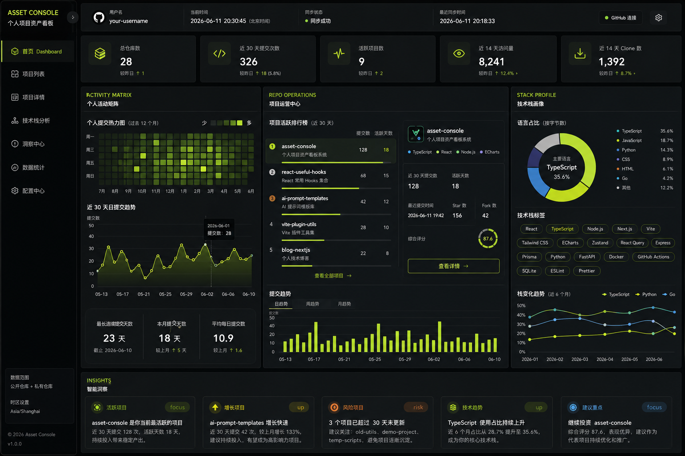
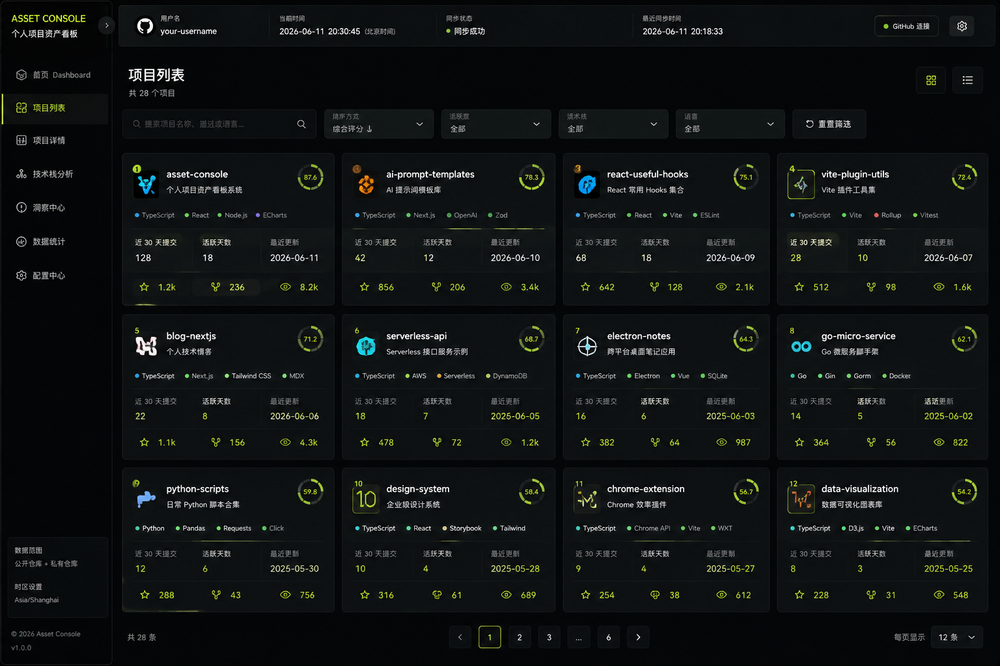
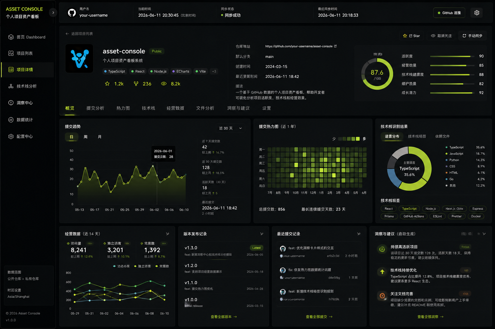
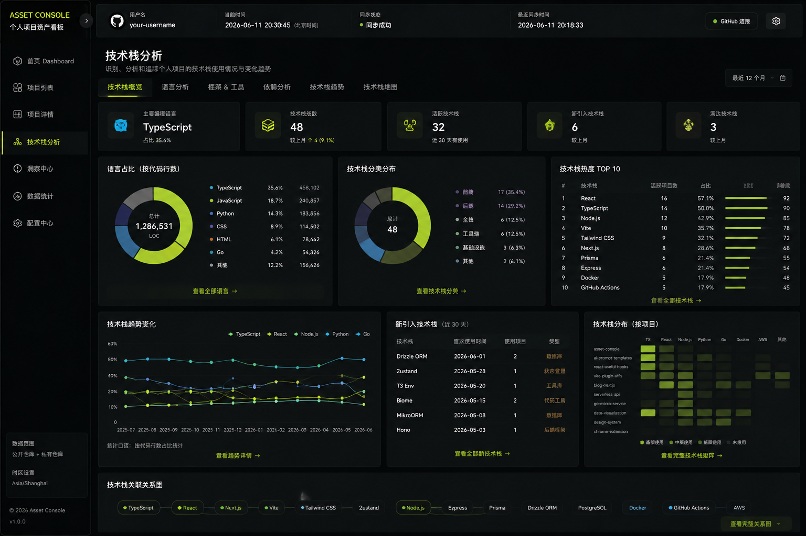
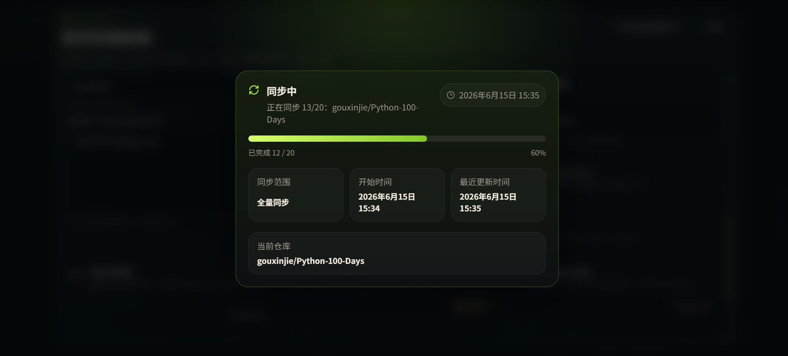
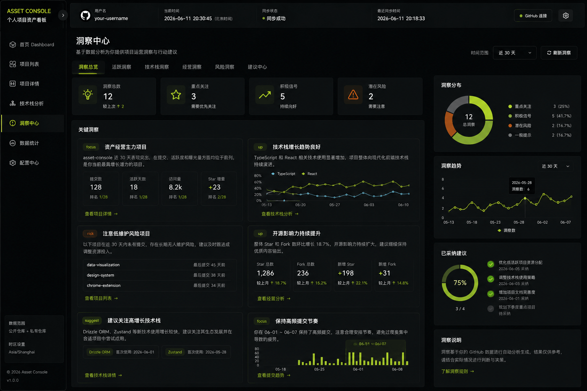
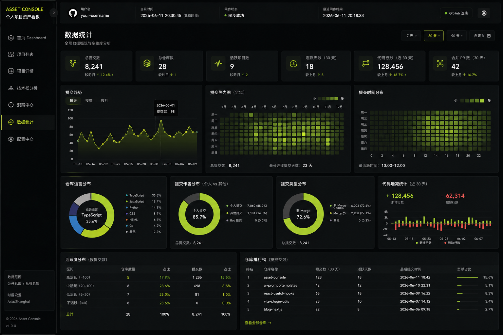
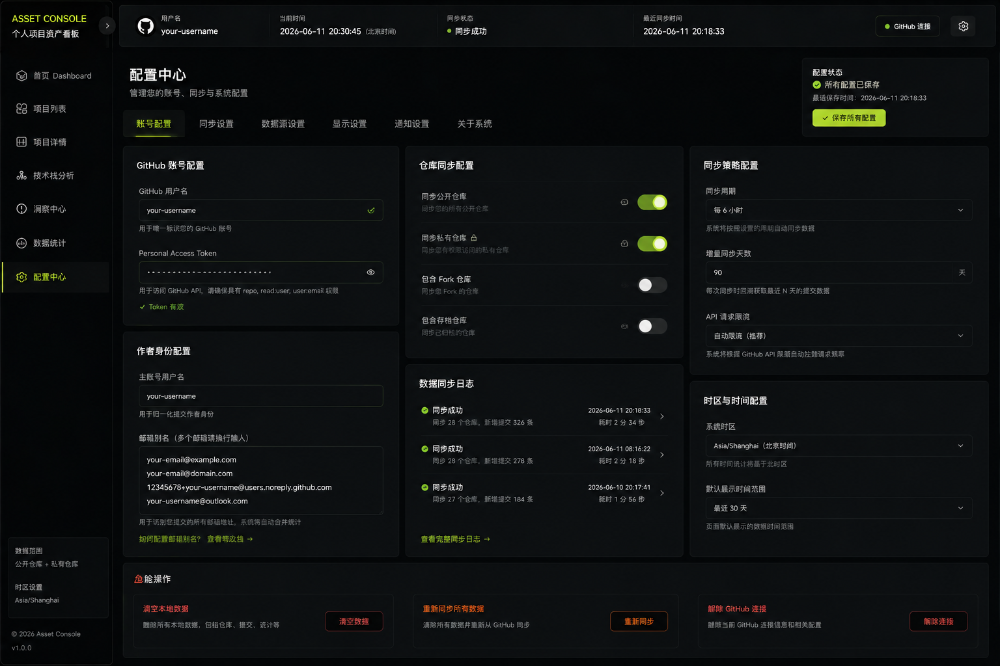

# CodeView

CodeView 是一个面向个人开发者的 GitHub 项目数据可视化产品，用来展示仓库活跃度、提交趋势、技术栈画像、流量表现和基础经营数据。


## 项目定位

- 产品名称：`CodeView`
- 产品类型：个人 GitHub 数据看板
- 核心目标：把分散的 GitHub 仓库数据沉淀到本地，形成可持续查看的可视化经营面板
- 适用场景：
  - 管理个人项目组合
  - 观察项目活跃度和趋势变化
  - 识别技术栈分布与演进方向
  - 跟踪近 14 天流量和近 30 天活跃表现

## 核心能力

- GitHub 账号配置与 Token 接入
- 仓库列表同步与基础信息持久化
- 提交记录、语言分布、流量数据同步
- 活跃度趋势、热力图、技术栈标签分析
- 项目评分、洞察卡片、统计看板展示
- SQLite 本地持久化与定时增量同步

## 技术栈

- 前端：`React`、`Vite`、`TypeScript`、`SCSS`、`ECharts`
- 后端：`Node.js`、`Express`、`TypeScript`
- 数据库：`SQLite`
- 状态管理：`Zustand`

## 页面设计图

#### 首页



####  项目列表



####  项目详情



####  技术栈分析



####  同步中



####  洞察中心



####  数据统计



####  配置中心



## 项目结构

```text
apps/
  server/                  Node.js + TypeScript 服务端
  web/                     React + Vite 前端
design-ui/                 设计图与页面参考
docx/                      项目补充文档（PRD、接口整理、技术总结等）
AGENTS.md                  项目协作约束
README.md                  项目说明文档
```

## 系统架构

```text
GitHub REST API
        │
        ▼
apps/server
  ├─ 配置管理
  ├─ 同步调度
  ├─ 数据清洗与聚合
  └─ SQLite 持久化
        │
        ▼
apps/web
  ├─ Dashboard
  ├─ 项目列表
  ├─ 项目详情
  ├─ 技术栈分析
  ├─ 洞察中心
  ├─ 数据统计
  └─ 配置中心
```

## 本地启动

### 1. 安装依赖

```bash
npm install
```

### 2. 初始化环境变量

```bash
# Windows PowerShell
Copy-Item .env.example .env

# macOS / Linux
cp .env.example .env
```

### 3. 启动开发环境

```bash
npm run dev
```

默认访问地址：

- 前端：`http://localhost:3100`
- 后端：`http://localhost:3101`

## 常用脚本

```bash
npm run dev
npm run dev:web
npm run dev:server
npm run build
npm run typecheck
```

## 环境变量

`.env.example` 当前包含以下变量：

- `SERVER_PORT`：后端服务端口，默认 `3101`
- `WEB_ORIGIN`：前端访问来源，默认 `http://localhost:3100`
- `DATABASE_PATH`：SQLite 数据库文件路径
- `DEFAULT_USER_ID`：默认本地用户 ID
- `ENCRYPTION_SECRET`：用于加密 GitHub Token 的密钥
- `ADMIN_USERNAME`：配置中心管理员用户名，默认 `xinjie`
- `ADMIN_PASSWORD`：配置中心管理员密码
- `GITHUB_TOKEN`：用于默认站点的数据源接入
- `GITHUB_INCLUDE_PRIVATE_REPOS`：是否同步私有仓库，默认 `false`

示例：

```env
SERVER_PORT=3101
WEB_ORIGIN=http://localhost:3100
DATABASE_PATH=./data/asset-console.db
DEFAULT_USER_ID=local-user
ENCRYPTION_SECRET=replace-with-a-long-random-string
ADMIN_USERNAME=xinjie
ADMIN_PASSWORD=replace-with-a-strong-admin-password
GITHUB_TOKEN=
GITHUB_INCLUDE_PRIVATE_REPOS=false
```

## GitHub Token 获取与配置

当前版本支持两种接入方式：

- 方式一：在“配置中心”以管理员身份登录后，填写 GitHub 用户名和 Token
- 方式二：在服务端 `.env` 中提供 `GITHUB_TOKEN`，供站点在首次启动时自动导入默认数据源

两种方式都会把 Token 保存在服务端并加密入库，前端只能看到是否已连接，不会拿到明文 Token。

如果你在 GitHub Actions / GitHub Secrets 里保存这个值，请不要把 Secret 直接命名为 `GITHUB_TOKEN`。GitHub Secrets 名称不能以 `GITHUB_` 开头，建议使用 `CODEVIEW_GITHUB_TOKEN`，再在部署流程中映射回服务端实际读取的 `GITHUB_TOKEN`。

### 获取入口

GitHub 官方入口：

- 个人访问令牌管理：<https://docs.github.com/en/authentication/keeping-your-account-and-data-secure/managing-your-personal-access-tokens>

GitHub 当前支持两种个人访问令牌：

- `Fine-grained personal access token`
- `Personal access token (classic)`

GitHub 官方整体上更推荐使用 `fine-grained token`，因为权限控制更细，也更符合后续权限治理。对这个项目来说，建议默认先尝试 `fine-grained token`；只有在你明确确认当前仓库场景更适合 classic token，并且组织策略允许时，再考虑 `classic token`。

### 推荐做法

如果你是第一次接这个项目，建议按下面顺序处理：

1. 打开 GitHub `Settings`
2. 进入 `Developer settings`
3. 进入 `Personal access tokens`
4. 优先选择 `Fine-grained tokens`
5. 创建新 Token
6. 复制生成后的 Token
7. 打开项目的“配置中心”
8. 填写 GitHub 用户名和 Token 并保存

### 使用 Fine-grained Token 时的建议

如果你选择 `fine-grained personal access token`，这个项目实际用到的接口涉及以下权限：

- `Get the authenticated user`：不需要额外权限
- `List repositories for the authenticated user`：仓库 `Metadata` 读取权限
- `List commits`：仓库 `Contents` 读取权限
- `Get repository content`：仓库 `Contents` 读取权限
- `Get page views` / `Get repository clones`：仓库 `Administration` 读取权限

如果你的仓库在组织下：

- 组织可能要求对 `fine-grained token` 先审批后使用
- 如果组织启用了 SSO，还可能需要额外授权 Token

### 使用 Classic Token 时的建议

如果你选择 `personal access token (classic)`，通常需要先确认两件事：

- 当前仓库或组织没有限制 classic token
- 你确实需要用 classic token 解决兼容性或历史流程问题

如果是组织仓库，优先先看组织的 Token 策略，再决定是否继续使用 classic token。

对这个项目来说，如果你要同步：

- 公开仓库：优先先用最小可用权限测试
- 私有仓库：通常需要更高的仓库访问权限
- 仓库流量数据：需要对对应仓库具备写入或 push 级别访问，接口本身也有访问前提限制

### 在项目里怎么填

如果你希望走页面配置方式，可通过“配置中心”填写：

- 页面入口：`配置中心`
- 填写项：
  - GitHub 用户名
  - GitHub Token
  - 是否包含私有仓库
  - 同步周期

保存后，后端会把 Token 加密后存到本地数据库中。

如果你希望让站点在生产环境启动后自动恢复你的默认数据源，也可以在 `.env` 中预先配置：

- `ADMIN_PASSWORD`
- `GITHUB_TOKEN`
- `GITHUB_INCLUDE_PRIVATE_REPOS`

启动时，服务端会在默认管理员用户尚未配置 Token 的情况下，自动用 `GITHUB_TOKEN` 拉取当前 GitHub 用户名并导入到 SQLite。导入完成后，后续定时同步仍然以数据库中的配置为准。

如果 `GITHUB_TOKEN` 无效、已过期，或者 GitHub API 暂时不可用，服务端会记录错误日志，但**不会阻止站点启动**；管理员可以在配置中心重新填写并保存新的 Token。

### 安全说明

- Token 只会在创建时完整显示一次，生成后请立即保存
- 不要把 Token 提交到 Git 仓库
- 不要把 Token 写死在前端代码里
- 如果 Token 泄露，应立即在 GitHub 后台撤销并重新生成
- 管理员登录接口已启用服务端失败限流与短时锁定，连续失败过多会被临时阻止继续尝试

### 官方参考

- 管理个人访问令牌：<https://docs.github.com/en/authentication/keeping-your-account-and-data-secure/managing-your-personal-access-tokens>
- 组织内管理个人访问令牌请求：<https://docs.github.com/en/organizations/managing-programmatic-access-to-your-organization/managing-requests-for-personal-access-tokens-in-your-organization>
- Fine-grained Token 权限说明：<https://docs.github.com/en/rest/authentication/permissions-required-for-fine-grained-personal-access-tokens>
- REST API 认证说明：<https://docs.github.com/en/rest/authentication/authenticating-to-the-rest-api>
- REST API 限流说明：<https://docs.github.com/en/rest/using-the-rest-api/rate-limits-for-the-rest-api>
- 仓库流量接口说明：<https://docs.github.com/en/rest/metrics/traffic>

## 数据同步说明

- 项目通过服务端统一调用 GitHub REST API
- 同步结果落库到本地 SQLite
- 配置中心默认以公开访客模式访问，只有 `.env` 中配置的管理员账号登录后才能修改配置和手动触发同步
- 服务启动时会恢复已配置的定时同步任务
- 定时任务默认间隔为 `720` 分钟，即 `12` 小时一次
- 自动任务执行的是增量同步，不会在服务启动瞬间立刻全量同步

GitHub 接口整理文档见：

- [项目使用的GitHub接口整理](./docx/项目使用的GitHub接口整理.md)

## 部署说明

当前仓库已提供一套可直接用于阿里云 ECS 的部署方案：

- GitHub Actions 构建镜像
- 推送到阿里云 ACR
- ECS 使用 Docker Compose 拉取镜像并启动

生产环境配置建议放在固定共享路径：

```text
/var/www/codeview/shared/.env
```

当前生产部署默认使用 `81` 端口，避免和宿主机常见的 `80` 端口服务冲突。此时需要把 `WEB_ORIGIN` 配成实际访问地址，例如：

```env
CODEVIEW_HTTP_PORT=81
WEB_ORIGIN=http://你的域名或公网IP:81
```

详细部署步骤见：

- [Docker Compose部署到ECS说明](./docx/Docker%20Compose部署到ECS说明.md)

## 当前页面范围

- `Dashboard`：全局总览与核心指标
- `Repositories`：仓库列表、筛选和排序
- `RepositoryDetail`：单仓库趋势、热力图、流量和最近提交
- `StackAnalysis`：技术栈标签、语言和趋势分析
- `InsightCenter`：自动生成洞察结论
- `Statistics`：综合统计数据展示
- `ConfigCenter`：GitHub 账号与同步策略配置

## 补充文档

- [PRD 文档](./docx/developer-operating-dashboard-prd.md)
- [项目使用的GitHub接口整理](./docx/项目使用的GitHub接口整理.md)
- [协作约束](./AGENTS.md)

## 开源协议

本项目采用 `MIT License` 开源，详见 [LICENSE](./LICENSE)。
